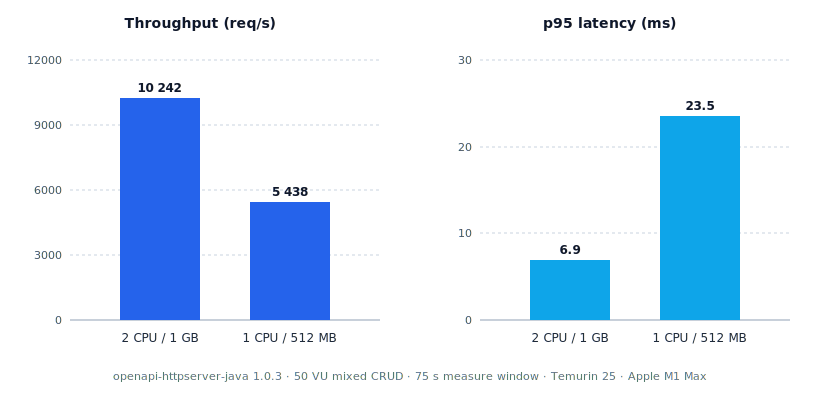
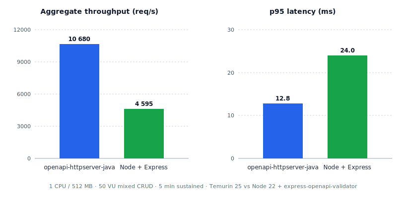

# openapi-httpserver-java

[](https://sonarcloud.io/dashboard?id=extenda_openapi-httpserver-java)
[](https://sonarcloud.io/dashboard?id=extenda_openapi-httpserver-java)
[](https://sonarcloud.io/dashboard?id=extenda_openapi-httpserver-java)
[](https://sonarcloud.io/dashboard?id=extenda_openapi-httpserver-java)
[](https://github.com/extenda/openapi-httpserver-java/actions)


# OpenAPI Server Library
A lightweight Java library for creating HTTP servers based on OpenAPI specifications.


## Overview
This library provides a simple way to create an HTTP server that implements OpenAPI specifications.

It is designed to be simple to use while providing the essential features needed for creating efficient HTTP servers in Java.

## Maven artifact

``` xml
<dependency>
  <groupId>com.retailsvc</groupId>
  <artifactId>openapi-httpserver-java</artifactId>
  <version>${openapi-httpserver-java.version}</version>
</dependency>
```

## Getting Started

### Prerequisites
- Java SDK 25 or later.
- A JSON library to parse the spec into a `Map<String, Object>`: any of Gson, Jackson, SnakeYAML (for YAML specs), or another mapper of your choice. The library itself doesn't bundle one.
- An OpenAPI 3.1.x specification (`openapi.json` or `openapi.yaml`).
- For `application/json` request/response bodies, either:
  - Gson on the classpath — auto-registered via the built-in `GsonJsonMapper` (integer-preserving, JSR-310 written as ISO-8601), or
  - Jackson via the built-in adapters — `Jackson2JsonTypeMapper(ObjectMapper)` for Jackson 2.x (`com.fasterxml.jackson.*`) or `Jackson3JsonTypeMapper(ObjectMapper)` for Jackson 3.x (`tools.jackson.*`). Caller supplies a configured `ObjectMapper`; the two adapters use disjoint package roots and can coexist on the same classpath.
  - any other `TypeMapper` you register via `Builder.jsonMapper(mapper)` (shortcut for `bodyMapper("application/json", mapper)`).
- Built-in mappers for `application/x-www-form-urlencoded` and `text/plain` need no configuration. Any other media type (`application/xml`, `application/cbor`, etc.) requires registering its own `TypeMapper`.


### Basic Usage
1. Create an OpenAPI specification file named `openapi.json` in your project resources.
2. Define your handlers using the `RequestHandler` functional interface. Handlers are pure functions: they consume a `Request` and return a `Response`. The framework renders the response (status code, headers, body) for you.
``` java
// Inline lambda — returns JSON using the built-in Gson mapper.
RequestHandler getDataHandler = req -> Response.ok(Map.of("id", "some-id"));

// Class form — reads raw bytes, the loose Map view, or a typed POJO.
public class PostDataHandler implements RequestHandler {
  @Override
  public Response handle(Request request) {
    // Access the raw request body bytes.
    byte[] body = request.bytes();
    // Loose structural view (Map / List / boxed primitives), produced by the registered TypeMapper.
    Object parsed = request.parsed();
    // Or get a typed POJO directly (works with the Gson and Jackson built-ins; both implement
    // TypedTypeMapper).
    MyDto dto = request.asPojo(MyDto.class);
    // Path parameters, query parameters, and headers are also available.
    String id = request.pathParam("id");                     // null if absent
    Optional<String> filter = request.queryParam("filter");  // empty if absent or blank
    Optional<String> corr = request.header("correlation-id");

    return Response.ok(dto);
  }
}
```

### Building responses

`Response` is an immutable record built via static factories. Pick the one that fits:

``` java
Response.empty();                                 // 204 No Content, no body
Response.status(200);                             // 200 OK, no body
Response.ok(Map.of("id", "42"));                  // 200 OK, JSON body via TypeMapper
Response.created(newResource);                    // 201 Created, JSON body
Response.created(newResource)
    .withHeader("Location", "/things/42");        // 201 Created + Location header
Response.accepted();                              // 202 Accepted, no body
Response.accepted(Map.of("jobId", "job-42"));     // 202 Accepted, JSON body
Response.notFound();                              // 404 Not Found, no body
Response.notFound(problemDetail);                 // 404 Not Found, JSON body
Response.notImplemented();                        // 501 Not Implemented, no body
Response.of(409, conflictDetail);                 // any status, JSON body
Response.text(200, "hello");                      // text/plain; UTF-8
Response.bytes(200, pdf, "application/pdf");      // pre-serialised bytes
Response.stream(200, "application/octet-stream",  // chunked streaming
    out -> out.write(largeBlob));
Response.stream(200, length, "application/pdf",   // sized streaming
    out -> pipeFromBackend(out));
```

Add or modify pieces non-destructively:

``` java
return Response.ok(payload)
    .withHeader("X-Tenant-Id", tenant)
    .withContentType("application/vnd.example+json");
```

A `null` body always produces a status-only response (`Content-Length: 0`, no body bytes), regardless of status code. Streaming bodies bypass `TypeMapper` entirely; one-shot object bodies (`ok`, `of`) are serialised by the `TypeMapper` registered for the response's content type (default `application/json`).

3. Initialize the server:
``` java
public class YourServerLauncher {
  public static void main(String[] args) throws Exception {
    // Gson is on the classpath, so we can load the spec in one line.
    Spec spec = Spec.fromPath(Path.of("openapi.json"));

    // Handlers by operationId.
    Map<String, RequestHandler> handlers = new HashMap<>();
    handlers.put("get-data", getDataHandler);
    handlers.put("post-data", new PostDataHandler());

    var server = OpenApiServer.builder()
        .spec(spec)
        .handlers(handlers)
        .exceptionHandler(Handlers.defaultExceptionHandler())
        .build();
  }
}
```

`Spec.fromPath(Path)` picks the parser by file extension: `.json` is parsed by Gson, `.yaml` / `.yml` by SnakeYAML. Both are optional dependencies of this library — the same Gson that powers the built-in JSON `TypeMapper`, and the same SnakeYAML you'd add explicitly to parse YAML. If the required parser isn't on the classpath the call fails with `IllegalStateException`; parse the file yourself and use `Spec.from(Map<String, Object>)` instead. Any other extension is rejected.

To load a spec from the classpath (including from inside a JAR) use the `InputStream` overloads:

``` java
Spec spec;
try (InputStream in = YourServerLauncher.class.getResourceAsStream("/openapi.json")) {
  spec = Spec.fromJson(in);   // Gson on the classpath
}
```

The matching `Spec.fromYaml(InputStream)` uses SnakeYAML. Both close the stream before returning. If you can't (or don't want to) depend on Gson, supply your own JSON parser:

``` java
ObjectMapper jackson = new ObjectMapper();
Spec spec;
try (InputStream in = YourServerLauncher.class.getResourceAsStream("/openapi.json")) {
  spec = Spec.fromJson(in, bytes -> jackson.readValue(bytes, Map.class));
}
```

YAML always parses through SnakeYAML — there's no parser-injecting overload. If you want a different YAML library, decode the stream yourself and call `Spec.from(Map<String, Object>)`.

### JSON mapping

The library ships an internal `GsonJsonMapper` that is auto-registered for `application/json` when Gson is on the classpath and no user-supplied JSON mapper has been registered. It:

- Returns JSON integers as `Long` and fractional numbers as `Double` for the loose `request.parsed()` view.
- For `request.asPojo(MyDto.class)`, delegates to Gson — the target type's fields determine the Java types (`int`, `long`, `Instant`, etc.).
- Round-trips JSR-310 types (`Instant`, `OffsetDateTime`, `ZonedDateTime`, `LocalDateTime`, `LocalDate`, `LocalTime`) as their ISO-8601 string form.

For Jackson, the library ships two adapters that wrap an `ObjectMapper` you configure (modules, naming strategy, JSR-310, date formats — all your call). Pick the one that matches your Jackson major:

```java
// Jackson 2.x  (group: com.fasterxml.jackson.core)
import com.fasterxml.jackson.databind.ObjectMapper;
import com.fasterxml.jackson.databind.SerializationFeature;
import com.fasterxml.jackson.datatype.jsr310.JavaTimeModule;

ObjectMapper objectMapper = new ObjectMapper()
    .registerModule(new JavaTimeModule())
    .disable(SerializationFeature.WRITE_DATES_AS_TIMESTAMPS);

var server = OpenApiServer.builder()
    .spec(spec)
    .jsonMapper(new Jackson2JsonTypeMapper(objectMapper))
    .handlers(handlers)
    .build();
```

```java
// Jackson 3.x  (group: tools.jackson.core)
import tools.jackson.databind.ObjectMapper;

ObjectMapper objectMapper = ObjectMapper.builder()
    // ... configure modules, features, etc.
    .build();

var server = OpenApiServer.builder()
    .spec(spec)
    .jsonMapper(new Jackson3JsonTypeMapper(objectMapper))
    .handlers(handlers)
    .build();
```

Jackson 3 made all I/O exceptions unchecked (`tools.jackson.core.JacksonException extends RuntimeException`), so `Jackson3JsonTypeMapper` propagates read/write failures as-is. `Jackson2JsonTypeMapper` wraps Jackson 2's checked `IOException` in `UncheckedIOException`.

The same shape applies to any custom mapper — implement `TypeMapper` (and optionally `TypedTypeMapper` if you can deserialise directly into a target type, so handlers can call `request.asPojo(MyDto.class)`).

If neither Gson is on the classpath nor any `application/json` mapper is registered, `build()` throws `IllegalStateException`.

### Body parsers and response writers

`TypeMapper` is the per-media-type read/write contract:

``` java
public interface TypeMapper {
  Object readFrom(byte[] body, String contentTypeHeader);
  byte[] writeTo(Object value);
}
```

Register a custom mapper for any media type via `Builder.bodyMapper(mediaType, mapper)`. Built-in defaults:

- `application/x-www-form-urlencoded` — read-only. Produces `Map<String, Object>`. A single value is a `String`; repeated keys produce a `List`.
- `text/plain` — read and write. Produces a decoded `String`; writes via `String.getBytes()`.
- `application/json` — auto-registered when Gson is on the classpath (see above).

User-supplied mappers take precedence over built-in defaults, so you can override any of the above.

### Response decorators

`Builder.responseDecorator(...)` registers a `ResponseDecorator` — a `(Request, Response) -> Response` transform applied to every handler's return value before rendering. Decorators compose in registration order: the result of one is fed to the next. Decorator-supplied headers override handler-supplied ones; if you want the opposite, set the header inside the handler with `Response.withHeader(...)`.

``` java
OpenApiServer.builder()
    .spec(spec)
    .handlers(handlers)
    .responseDecorator((req, resp) -> resp.withHeader("X-Correlation-Id", CorrelationId.current()))
    .responseDecorator((req, resp) -> resp.withHeader("X-Tenant-Id", TenantId.current()))
    .build();
```

### Request interceptors

`Builder.interceptor(...)` registers a `RequestInterceptor` that wraps every handler invocation. Use it for `ScopedValue` bindings, MDC, authentication, tracing, or any concern that needs to run uniformly around handlers. Interceptors compose in registration order: the first registered runs outermost. Each interceptor must call `next.proceed()` and return the result (or a transformed `Response`).

``` java
OpenApiServer.builder()
    .spec(spec)
    .handlers(handlers)
    .interceptor((request, next) -> {
      // Resolve once per request; bind to a ScopedValue for the rest of the chain.
      String tenant = request.header("X-Tenant-Id").orElse("public");
      return ScopedValue.where(TENANT, tenant).call(next::proceed);
    })
    .interceptor((request, next) -> {
      MDC.put("op", request.operationId());
      try {
        return next.proceed();
      } finally {
        MDC.remove("op");
      }
    })
    .build();
```

Exceptions propagate to the library's standard `ExceptionFilter` and `ExceptionHandler` pipeline.

### Combining interceptors and decorators

The two collaborate naturally: the interceptor binds per-request context once, and the decorator reads that context when stamping response headers. Handlers stay pure business logic.

``` java
// Per-request context populated by the interceptor, read by the decorator and handlers.
ScopedValue<String> CORRELATION_ID = ScopedValue.newInstance();
ScopedValue<String> TENANT_ID = ScopedValue.newInstance();

OpenApiServer.builder()
    .spec(spec)
    .handlers(handlers)
    // 1. Resolve once per request and bind to ScopedValues.
    .interceptor((request, next) -> {
      String correlationId =
          request.header("X-Correlation-Id").orElseGet(() -> UUID.randomUUID().toString());
      String tenantId = resolveTenant(request);
      return ScopedValue.where(CORRELATION_ID, correlationId)
          .where(TENANT_ID, tenantId)
          .call(next::proceed);
    })
    // 2. Stamp those values on every response.
    .responseDecorator((req, resp) -> resp
        .withHeader("X-Correlation-Id", CORRELATION_ID.get())
        .withHeader("X-Tenant-Id", TENANT_ID.get()))
    .build();
```

Decorators run inside the interceptor's `ScopedValue` binding (the decorator transforms the `Response` returned by `next.proceed()`, which is still on the call stack), so `CORRELATION_ID.get()` / `TENANT_ID.get()` see the bound values.

A handler in this setup is just business logic:

``` java
public class GetPromotionHandler implements RequestHandler {
  @Override
  public Response handle(Request request) {
    String id = request.pathParam("id");
    String tenant = TENANT_ID.get();
    return promotionService
        .find(tenant, id)
        .<Response>map(Response::ok)
        .orElseGet(Response::notFound);
  }
}
```

### End-to-end example

Gson on the classpath for request/response JSON, SnakeYAML on the classpath for the spec, one interceptor binding a request-scoped tenant + correlation id, one decorator stamping the correlation id on every response, one handler. No extra wiring.

``` java
package com.example.promotions;

import com.retailsvc.http.OpenApiServer;
import com.retailsvc.http.Request;
import com.retailsvc.http.RequestHandler;
import com.retailsvc.http.Response;
import com.retailsvc.http.spec.Spec;
import java.nio.file.Path;
import java.util.Map;
import java.util.Optional;
import java.util.UUID;

public final class App {

  static final ScopedValue<String> TENANT = ScopedValue.newInstance();
  static final ScopedValue<String> CORRELATION_ID = ScopedValue.newInstance();

  public static void main(String[] args) throws Exception {
    Spec spec = Spec.fromPath(Path.of("openapi.yaml"));         // SnakeYAML parses the spec

    RequestHandler getPromotion = req -> {
      String id = req.pathParam("id");
      return PromotionService.find(TENANT.get(), id)            // uses bound tenant
          .<Response>map(Response::ok)                           // 200 + JSON via Gson
          .orElseGet(Response::notFound);                        // 404, no body
    };

    OpenApiServer.builder()
        .spec(spec)
        .handlers(Map.of("get-promotion", getPromotion))
        // Bind tenant + correlation id once per request.
        .interceptor((req, next) -> {
          String tenant = req.header("X-Tenant-Id").orElse("public");
          String correlationId =
              req.header("X-Correlation-Id").orElseGet(() -> UUID.randomUUID().toString());
          return ScopedValue.where(TENANT, tenant)
              .where(CORRELATION_ID, correlationId)
              .call(next::proceed);
        })
        // Stamp the correlation id on every response.
        .responseDecorator((req, resp) -> resp.withHeader("X-Correlation-Id", CORRELATION_ID.get()))
        .port(8080)
        .build();
  }
}
```

What the example demonstrates:

- **Gson is the default JSON serializer.** No explicit `bodyMapper(...)` call — the library auto-registers `GsonJsonMapper` for request and response JSON because Gson is on the classpath.
- **SnakeYAML parses the spec.** `Spec.fromPath(...)` picks the parser by file extension; `.yaml` here means SnakeYAML, and Gson would handle `.json` the same way.
- **One interceptor sets cross-cutting context.** `ScopedValue.where(...).call(next::proceed)` runs the handler (and any inner interceptors and decorators) inside the binding, so `TENANT.get()` and `CORRELATION_ID.get()` work anywhere they're called.
- **One decorator stamps a response header.** `Response.withHeader(...)` is non-destructive — the handler's `Response` is replaced with one that has the extra header.
- **Handler is a pure function.** Reads from `Request`, returns a `Response` value. No `HttpExchange`, no try/catch IOException, no builder.

### Security (OpenAPI `securitySchemes` + `security`)

The library parses `components.securitySchemes` and the `security` requirement lists (root-level and per-operation), extracts the credential per scheme, hands it to a consumer-provided `SchemeValidator` callback, and renders RFC 7807 `application/problem+json` rejections — 401 for missing/malformed credentials (with `WWW-Authenticate`), 403 when the validator denies.

Supported scheme types in this release:

- `apiKey` (in `header`, `query`, or `cookie`)
- `http` `bearer`
- `http` `basic`

`oauth2`, `openIdConnect`, and `mutualTLS` are parsed into a placeholder type (`SecurityScheme.Unsupported`) — if any operation actually *references* one of those scheme names, the server fails at boot.

#### Declaring schemes in the spec

```yaml
components:
  securitySchemes:
    apiKeyAuth:
      type: apiKey
      name: X-API-Key
      in: header
    bearerAuth:
      type: http
      scheme: bearer
    basicAuth:
      type: http
      scheme: basic

# Either default for every operation:
security:
  - bearerAuth: []

# Or attach per-operation (overrides the root default):
paths:
  /reports/{id}:
    get:
      operationId: getReport
      security:
        - apiKeyAuth: []
      responses:
        "200": { description: ok }
```

`security: []` on an operation means "no security required" (overrides the root default). Omitting `security` on an operation inherits the root default.

When several entries appear in `security`, they are OR-ed; the request is allowed if *any* entry's schemes all validate. Multiple keys *inside* one entry are AND-ed:

```yaml
security:
  # Either an API key …
  - apiKeyAuth: []
  # … or BOTH a bearer token AND a tenant header validator:
  - bearerAuth: []
    tenantAuth: []
```

#### Registering validators

```java
import com.retailsvc.http.Credential;
import com.retailsvc.http.Credential.ApiKeyCredential;
import com.retailsvc.http.Credential.BearerCredential;
import com.retailsvc.http.Credential.BasicCredential;
import com.retailsvc.http.OpenApiServer;
import java.util.Optional;

OpenApiServer.builder()
    .spec(spec)
    .handlers(handlers)
    .securityValidator("apiKeyAuth", (request, credential) -> {
      String key = ((ApiKeyCredential) credential).value();
      return apiKeyStore.lookup(key).map(user -> user);   // Optional<User>
    })
    .securityValidator("bearerAuth", (request, credential) -> {
      String token = ((BearerCredential) credential).token();
      return jwt.verify(token).map(claims -> claims);     // Optional<JwtClaims>
    })
    .securityValidator("basicAuth", (request, credential) -> {
      BasicCredential bc = (BasicCredential) credential;
      return userService
          .authenticate(bc.username(), bc.password())
          .map(user -> user);                              // Optional<User>
    })
    .build();
```

The library guarantees the `Credential` variant matches the scheme's declared type — `apiKey` schemes deliver `ApiKeyCredential`, `http` `bearer` delivers `BearerCredential`, `http` `basic` delivers `BasicCredential`. Pattern matching is cleaner than casts:

```java
.securityValidator("multi", (request, credential) -> switch (credential) {
  case ApiKeyCredential ak -> apiKeyStore.lookup(ak.value()).map(user -> user);
  case BearerCredential b  -> jwt.verify(b.token()).map(claims -> claims);
  case BasicCredential bc  -> userService.authenticate(bc.username(), bc.password()).map(u -> u);
})
```

#### Constructing the principal

A *principal* is whatever the library hands back to the handler after a successful authentication. The library does NOT define a `Principal` type — your validator returns `Optional<Object>` and the library stashes the value on the `Request` under the scheme name. **Whatever you return becomes your principal.**

Three common patterns:

**1. A domain record.** Best for typed access in handlers.

```java
public record AuthenticatedUser(String userId, String tenantId, Set<String> roles) {}

.securityValidator("bearerAuth", (request, credential) -> {
  String token = ((BearerCredential) credential).token();
  return jwt.verify(token).map(claims ->
      new AuthenticatedUser(claims.subject(), claims.tenant(), claims.roles()));
})
```

Handler reads it:

```java
public Response handle(Request request) {
  AuthenticatedUser user = (AuthenticatedUser) request.principal("bearerAuth").orElseThrow();
  return Response.ok(reports.findForTenant(user.tenantId()));
}
```

**2. A `Map<String, Object>` of claims.** Useful when the shape is dynamic or you want to forward JWT claims as-is.

```java
.securityValidator("bearerAuth", (request, credential) ->
    jwt.verify(((BearerCredential) credential).token()).map(claims -> Map.copyOf(claims.asMap())))
```

```java
@SuppressWarnings("unchecked")
Map<String, Object> claims = (Map<String, Object>) request.principal("bearerAuth").orElseThrow();
String sub = (String) claims.get("sub");
```

**3. A plain `String` identifier.** Simplest when the handler only needs an ID.

```java
.securityValidator("apiKeyAuth", (request, credential) ->
    apiKeyStore.lookup(((ApiKeyCredential) credential).value())) // Optional<String> userId
```

```java
String userId = (String) request.principal("apiKeyAuth").orElseThrow();
```

If your operation requires multiple schemes simultaneously (AND-group), all principals are stashed under their scheme names:

```java
Map<String, Object> principals = request.principals();   // {"bearerAuth": claims, "tenantAuth": tenant}
```

Returning `Optional.empty()` from a validator means "deny" — the library then returns 403 Forbidden (or 401 if no scheme produced a valid credential at all). Throwing from a validator propagates to the configured `ExceptionHandler`; it does NOT count as deny, so let your validators throw on internal errors and return `Optional.empty()` only when the credential is genuinely invalid.

#### Boot-time validation

If `security` references a scheme that has no registered `securityValidator(...)`, is undeclared in `components.securitySchemes`, or uses an unsupported type, `OpenApiServer.builder()...build()` throws `IllegalStateException` immediately. You can't ship a server that's missing an auth check by accident — the failure is loud at startup, not silent at request time.

#### Opt-out: external authentication

In some deployments authentication happens upstream — for example, an Envoy sidecar with OPA, or an API Gateway like Apigee that already verified the credential before the request reaches your JVM. In that case the credential never arrives in a form the library can validate (or the library would be re-validating something the gateway already proved), and forcing you to register stub validators is just friction.

`useExternalAuthentication()` opts the entire library out of in-process enforcement:

```java
OpenApiServer.builder()
    .spec(spec)
    .handlers(handlers)
    .useExternalAuthentication()    // SecurityFilter becomes a no-op
    .build();
```

Effects when set:

- `SecurityFilter` short-circuits to the next chain step regardless of any `security` declarations — every request reaches the handler.
- The boot-time validator-registration check is skipped, so you don't have to register `.securityValidator(...)` callbacks at all.
- `Request.principals()` returns an empty map; `Request.principal(name)` returns `Optional.empty()`. **The library never reads sidecar-set headers.** If you want a principal in the handler, write a normal `RequestInterceptor` that reads whatever header the sidecar sets and binds a `ScopedValue` (or stashes on the request via a domain wrapper of your own).

Typical sidecar pattern:

```java
ScopedValue<String> AUTHENTICATED_USER = ScopedValue.newInstance();

OpenApiServer.builder()
    .spec(spec)
    .handlers(handlers)
    .useExternalAuthentication()
    .interceptor((request, next) -> {
      String user = request.header("X-Authenticated-User").orElseThrow();
      return ScopedValue.where(AUTHENTICATED_USER, user).call(next::proceed);
    })
    .build();
```

The library still parses `components.securitySchemes` and exposes it via `spec.securitySchemes()` — useful if you serve the OpenAPI document or wire a docs UI — it just stops short of *enforcing* anything.

### Request body content types

The server reads `requestBody.content` from the spec and selects a mapper by the request's media type (the bare `type/subtype` from `Content-Type`, e.g. `application/json`; lookup is case-insensitive):

| Content type                          | Parser                                                                       | Coercion |
| ------------------------------------- | ---------------------------------------------------------------------------- | -------- |
| `application/json`                    | `GsonJsonMapper` (auto) or caller-supplied `TypeMapper`                      | No — strict against the schema |
| `application/x-www-form-urlencoded`   | Built-in. `Map<String, Object>`. A single value is a `String`; repeated keys produce a `List`. After coercion the element type tracks the schema (e.g. an `integer` array yields `List<Long>`). | Yes — field values coerced to the property schema type (integer / number / boolean / array of those) |
| `text/plain`                          | Built-in. Decoded `String`                                                   | No — schema should be `type: string` |

Form-field coercion mirrors the rules already used at the parameter boundary: the wire is string-only by definition, so a property typed as `integer` accepts `"42"` and yields `42`. Coercion failures surface as RFC-7807 `400` responses with a JSON-pointer to the failing field.

Both built-in parsers honour the `charset=` parameter on the `Content-Type` header (default UTF-8). Unknown charsets fall back to UTF-8.

### Error responses (RFC 7807)

Validation failures — missing required fields, type mismatches, unsupported content types, coercion errors, malformed bodies — produce an `HTTP 400 Bad Request` response with body media type `application/problem+json`, following [RFC 7807](https://datatracker.ietf.org/doc/html/rfc7807).

A single error is reported per request (first failure wins). The response body has these fields:

| Field      | Type    | Description                                                                              |
| ---------- | ------- | ---------------------------------------------------------------------------------------- |
| `type`     | string  | Always `about:blank` (no per-error type URI).                                            |
| `title`    | string  | Always `Bad Request`.                                                                    |
| `status`   | integer | Always `400`.                                                                            |
| `detail`   | string  | Human-readable description of the failure (e.g. `expected integer`).                     |
| `pointer`  | string  | [RFC 6901](https://datatracker.ietf.org/doc/html/rfc6901) JSON-Pointer to the failing location (e.g. `/body/age`, `/query/limit`, `/path/id`, or `/body` for body-wide errors). |
| `keyword`  | string  | The validation rule that failed: `type`, `required`, `enum`, `pattern`, `format`, `minimum`, `maximum`, `minLength`, `maxLength`, `additionalProperties`, `oneOf`, `anyOf`, `allOf`, `not`, `const`, `content-type`, `decode`, … |

Example body for `POST /form-echo` with `age=abc` (`age` is declared as `integer`):

``` json
{
  "type": "about:blank",
  "title": "Bad Request",
  "status": 400,
  "detail": "expected integer",
  "pointer": "/age",
  "keyword": "type"
}
```

Other error responses:

- **404 Not Found** — no route matches the request path (no body).
- **405 Method Not Allowed** — path matches but the HTTP method isn't declared. Includes an `Allow` header listing permitted methods (no body).
- **500 Internal Server Error** — uncaught exception from a handler. No body by default; override `ExceptionHandler` if you need a different envelope.

The error mapping is performed by `Handlers.defaultExceptionHandler()`. Pass your own `ExceptionHandler` to `OpenApiServer.builder().exceptionHandler(...)` if you need a different response shape (e.g. multi-error collection, custom problem types, locale-aware `detail`).

### Extra (non-OpenAPI) handlers

Mount handlers at arbitrary paths outside the OpenAPI spec — useful for liveness probes,
serving the spec document itself, or any other operational endpoint that should not be subject
to OpenAPI parameter / body validation.

``` java
var server = OpenApiServer.builder()
    .spec(spec)
    .handlers(handlers)
    .extraRoute("/alive", Handlers.aliveHandler())
    .extraRoute("/schemas/v1/openapi.yaml",
                Handlers.specHandler("/schemas/v1/openapi.yaml"))
    .build();
```

Extra handlers bypass OpenAPI validation but are still wrapped in the configured
`ExceptionHandler`, so any uncaught exception is rendered using the same error envelope as
API routes.

Built-in helpers:
- `Handlers.aliveHandler()` — 204 No Content on `GET`/`HEAD`, 405 otherwise.
- `Handlers.specHandler(classpathResource)` — serves a classpath resource (content-type
  inferred from extension). Throws `IllegalArgumentException` at construction if the resource
  is missing.

The original public constructors remain available for back-compat.

### Graceful shutdown

`OpenApiServer` exposes `stop(int delaySeconds)` for explicit shutdown that waits up to the
given number of seconds for in-flight exchanges to complete before closing them. `0` stops
immediately. The same drain timeout can be wired into `close()` (and therefore
try-with-resources) via the builder:

```java
try (var server = OpenApiServer.builder()
    .spec(spec)
    .handlers(handlers)
    .shutdownTimeoutSeconds(5)   // close() drains up to 5s; default is 0
    .build()) {
  // serve requests...
} // close() now waits up to 5s for in-flight exchanges
```

`stop(int)` and `shutdownTimeoutSeconds(int)` reject negative values with
`IllegalArgumentException`.

## Features
- OpenAPI specification support
- Automatic request body parsing and response writing per media type via `TypeMapper`
- `RequestHandler` functional interface — a single `handle(Request)` method replaces raw `HttpExchange` manipulation
- Handlers are pure functions: `Response handle(Request)`. Factories cover `empty()` / `status(int)` / `ok(Object)` / `of(int, Object)` / `text(int, String)` / `bytes(int, byte[], String)` / `stream(...)`
- Built-in `GsonJsonMapper` auto-registered when Gson is on the classpath (no explicit wiring needed)
- `ResponseDecorator` for cross-cutting response headers and `RequestInterceptor` for around-style ScopedValue / MDC / auth concerns
- Built on Java's native `HttpServer` with Thread-Per-Request behaviour using Virtual Threads


## Handler Registration
Handlers are registered in a `Map<String, RequestHandler>` keyed by OpenAPI `operationId`.

## Local development

To test the server in isolation, you can start an example server (`src/test/java/com/retailsvc/http/start/ServerLauncher.java`).
Schemas are located under test resources folder.

- Example requests can be found under `acceptance/k6` that can be a base for exploring the functionality.
- The logger in the configuration needs to be enabled to get some insight into the code.

## Caveats

- **Single-process model.** No horizontal scaling primitives are bundled; run multiple instances behind a load balancer for production scale.
- **JDK `HttpServer` is the throughput ceiling.** It's documented as a low-throughput / dev-test server. If you need to go materially above the rates shown under [Performance](#performance), the handler-facing API (`Request`, `Response`, `RequestHandler`, `RequestInterceptor`, `ResponseDecorator`, `TypeMapper`) is transport-neutral by design — `Request` is built from primitives (body bytes, raw query string, path parameters, a header lookup function), not a JDK `HttpExchange`. A future enhancement could plug in a higher-throughput backend (Jetty, Helidon Níma, Netty) by writing a new adapter behind `com.retailsvc.http.internal` while leaving handlers untouched.
- **Per-request state uses `ScopedValue`** (Java 25, JEP 506). This matters if a handler offloads work to an executor that's not a `StructuredTaskScope`-managed child thread: the `ScopedValue` is not visible there, so the handler must capture the values it needs (e.g. `byte[] body = request.bytes();`) before submitting.
- **Empty responses use `Response.empty()` (204) or `Response.status(code)` for other no-body statuses.** The renderer sends `responseLength = -1` (`Content-Length: 0`, no body) for any `Response` with `body() == null`, regardless of status code. Passing `0` to the JDK directly produces a chunked response with zero chunks, which is technically non-conformant — `Response` factories handle this for you.

## Performance

The chart below shows sustained throughput and 95th-percentile latency of `openapi-httpserver-java` under a mixed-CRUD load (50 concurrent virtual users driven by k6 for 75 s after a 20 s warmup). The bench handlers do the minimum: parse the request via the registered `TypeMapper`, hit an in-memory store, and return a `Response`. There are no synthetic sleeps, no downstream calls, and no database — what you see is the framework path itself: routing, OpenAPI validation, JSON (de)serialisation, response rendering.

Two profiles, both inside a CPU- and memory-capped Docker container running Temurin 25 on an Apple M1 Max:

- **2 CPU / 1 GB** — the default profile. The framework sustains over 10,000 req/s with a p95 under 7 ms.
- **1 CPU / 512 MB** — the constrained profile. Throughput halves with CPU (the framework is CPU-bound, not lock- or IO-bound), and tighter memory pressures G1 into more old-generation collections, widening p95 to ~24 ms. The median request still completes in ~4 ms.



### How does that compare?

This is not a competition — different runtimes, different ecosystems, different sweet spots. It's a sanity check: where does `openapi-httpserver-java` land against a familiar reference point on the same hardware, under the same load?

The reference point is a deliberately minimal Node.js service: Express 4 with `express-openapi-validator` against the same OpenAPI spec, handlers stripped to the same "parse, touch in-memory store, respond" shape, no synthetic sleeps. Both run inside the same 1 CPU / 512 MB Docker container; k6 drives the same mixed-CRUD workload at 50 VUs for 5 minutes of sustained measurement.

| Metric (1 CPU / 512 MB) | openapi-httpserver-java | Node + Express |
|---|---|---|
| Aggregate throughput | **10,680 req/s** | 4,595 req/s |
| p50 latency | 3.5 ms | 8.7 ms |
| p95 latency | 12.8 ms | 24.0 ms |
| p99 latency | 24.7 ms | 35.4 ms |



A few things worth keeping in mind when reading this:

- **Both stacks held up for the full 5 minutes** with stable tails — nothing pathological on either side.
- **The Java advantage is mostly the JIT and the JVM thread pool.** Once hot, the framework dispatches requests through compiled code on real OS threads; Node serialises everything through a single event loop and pays for per-request JS validation in `express-openapi-validator`.
- **It is not a 10× story.** At 1 vCPU both runtimes are CPU-bound on essentially the same task. Expect roughly 2× throughput and ~2× tighter tail latency, not a runaway.
- The Node service used here is intentionally minimal; a tuned Fastify + AJV setup would close some of the gap, and a Go or Rust service would likely open it again in the opposite direction. The point of the comparison is to give you a feel for the ballpark, not to crown a winner.

## Known limitations or missing features
